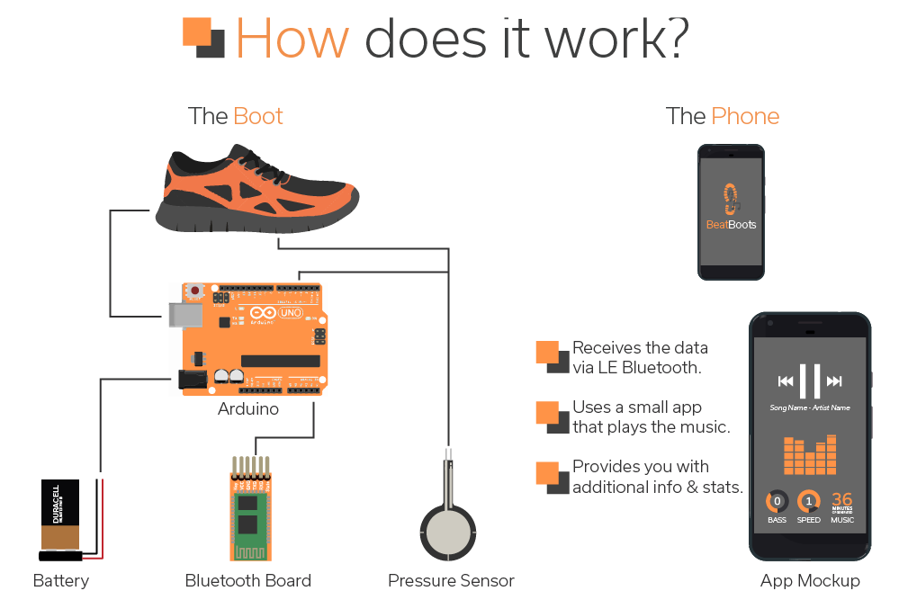

# BeatBoots

BeatBoots is an Arduino project. It consists of a pair of running shoes for joggers that generate a song based on how you run. If you for example speed up, the music matches your speed. Things like the bass and hat are less pronounced when you are walking. 

Every step is a beat. So you are essentially making your own music while jogging. The music is played on your phone with a simple app that connects via Bluetooth. 

An ideal version of the concept:

About
--------------
I made this project for a school assignment. It is a really early prototype, so expect it to be rough around the edges. The app is for Android 4.2 and up. 

Getting Started
--------------
Check out the Guide.pdf to learn how to build and use this project. It also contains a parts list.

To use the Android app, download the project file and open it in Android Studio. Make sure your Android phone supports Android 4.2 or higher.

To use the Arduino code, you must install Adafruits libaries. You can find the libaries and how to install them here: https://learn.adafruit.com/getting-started-with-the-nrf8001-bluefruit-le-breakout/software-uart-service

Credits
--------------
The app is based on the nRF-UART app from NordicSemiconductor, check it out here:
https://github.com/NordicSemiconductor/Android-nRF-UART
